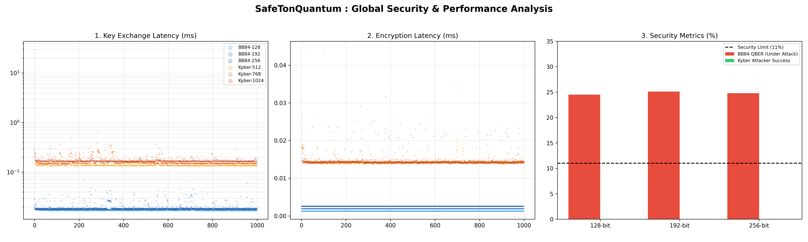
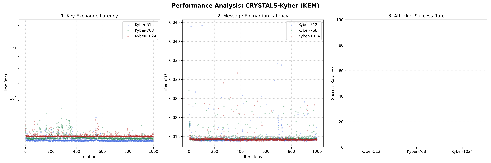

# SafeTonQuantum : Benchmarking de Cryptographie Post-Quantique

Ce dépôt contient le code source, les données d'expérimentation et les visualisations du projet **SafeTonQuantum**, réalisé dans le cadre de notre cycle ingénieur à l'ECE Paris (Promotion 2026).

Face à la menace imminente de l'informatique quantique (algorithme de Shor), ce projet vise à évaluer, implémenter et comparer les performances des nouveaux standards de cryptographie post-quantique (NIST FIPS 203/204) et des protocoles de distribution quantique de clés (QKD).

---

## 1. Architecture du Projet

Le dépôt est structuré de manière à séparer clairement la logique applicative, les données brutes et les livrables visuels :

* `/src/` : Scripts Python contenant les implémentations simplifiées et les suites de tests (Kyber, Dilithium, BB84).
* `/results/` : Données brutes issues des benchmarks (fichiers `.csv`), garantissant la reproductibilité de notre étude.
* `/figures/` : Visualisations analytiques (fichiers `.png`) générées automatiquement à partir des résultats.

---

## 2. Résultats et Visualisations

Nos scripts exécutent des milliers d'itérations pour garantir une analyse statistique robuste. Voici les principales conclusions de nos expérimentations.

### Comparaison Globale : PQC (Kyber) vs QKD (BB84)
Analyse du compromis entre latence opérationnelle et robustesse sécuritaire. Le graphique ci-dessous illustre le temps d'échange de clés, le temps de chiffrement et la résilience face à un attaquant (QBER pour BB84 vs Taux de succès pour Kyber).



### Focus : Performance de CRYSTALS-Kyber
Évaluation approfondie du mécanisme d'encapsulation de clés (KEM) Kyber pour ses trois niveaux de sécurité (512, 768 et 1024 bits).



*(Note technique : L'analyse complète de Dilithium a été réalisée en parallèle et est détaillée dans notre article de recherche).*

---

## 3. Déploiement et Exécution

Pour reproduire nos benchmarks localement et générer les données, un environnement Python 3.11 ou supérieur est requis.

### Installation

1. Cloner le dépôt :
```bash
git clone [https://github.com/eudesBr1/SafeTonQuantum.git](https://github.com/eudesBr1/SafeTonQuantum.git)
cd SafeTonQuantum
```
Installer les dépendances requises :
```bash
pip install pandas numpy matplotlib
```
Lancement des Suites de Tests
L'exécution doit respecter l'ordre suivant pour garantir la disponibilité des données de visualisation :

Lancer le benchmark Kyber :
```bash

python src/kyber_bench.py
Lancer la génération des données brutes BB84 :
```
```bash
python src/bb84_raw_data.py
```
Générer la visualisation comparative finale :
```bash

python src/visualisation.py
```
Les graphiques mis à jour seront automatiquement sauvegardés dans le répertoire /figures/.

4. Équipe et Supervision
Membres de l'équipe (ECE Paris) :

Eudes Boyer

Antoine Bouveret

Ronald Donfack

Romain Lignères

Quentin Robalo

Supervision Académique :

Pr. Amine JAOUADI (Laboratoire de Recherche - Avril 2026)
